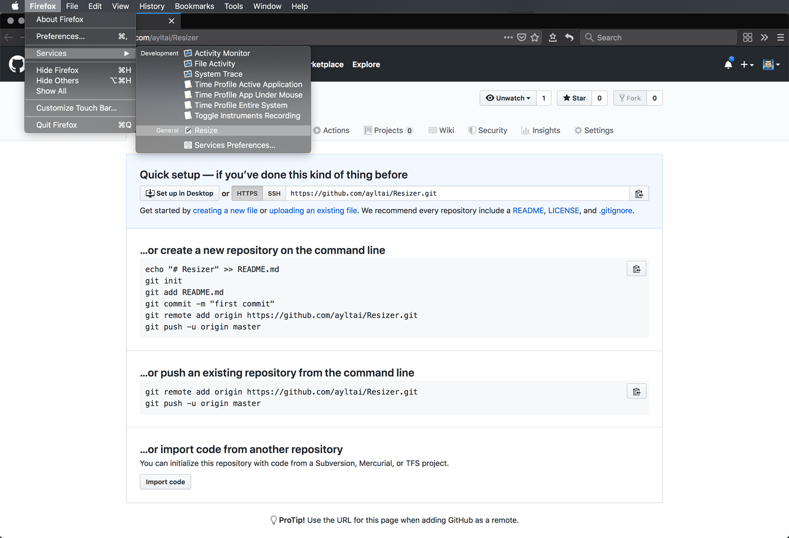
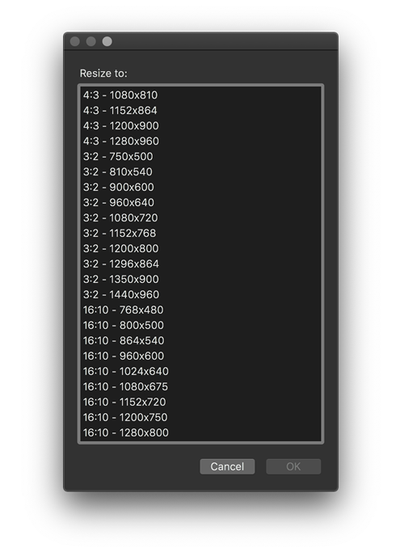
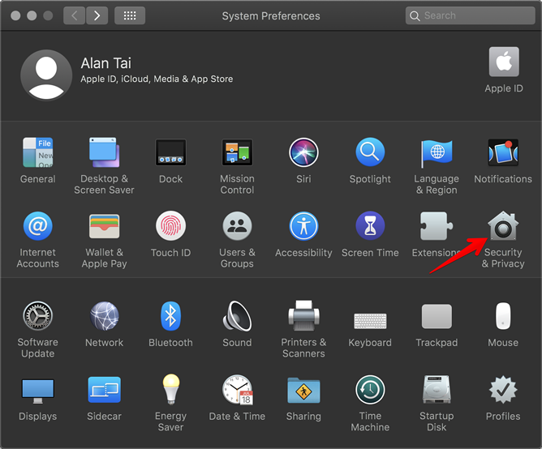
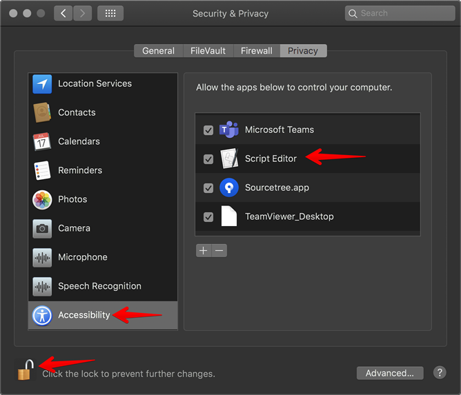

Resizer
=======
Resize any windows in macOS with ease.

## Features
* Resize any application windows
* Support 4:3, 3:2, 16:10 and 16:9 resolutions

## Getting started
1. Double-click `install.command` to install Resizer as a systemwide service
2. Click on any window you want to resize
3. Click menu > Services > Resize
4. Select a preferred size and click OK

## Under the hood
Resizer is an [Automator Workflow](https://support.apple.com/en-hk/guide/automator/welcome/mac) installed as a systemwide service. For some application windows, you may need to authorize the accessibility permission in System Preferences.

